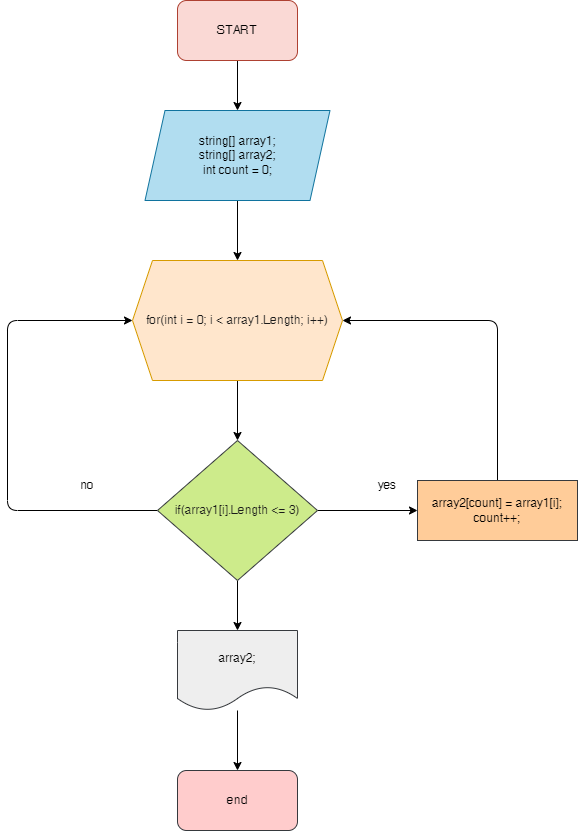

# **Итоговая проверочная работа**
## **Задача** ##
Написать программу, которая из имеющегося массива строк формирует массив из строк, длина которых меньше либо равно 3 символа. Первичный массив можно ввести с клавиатуры, либо задать на старте выполнения алгоритма. При решение не рекомендуется пользоваться коллекциями, лучше обойтись исключительно массивами.
## **Описание алгоритма решения:** ##
Задается заполненый строками массив и второй массив пустой размерностью первого массива.

Создаем метод в котором при помощи цикла *for*, через проверку заданого нам условия в задаче, заполняем пустой массив значениями из первого массива.
Создаем метод вывода массива.

Графическое исполнение:

Реализация алгоритма - TaskFinal/Program.cs
